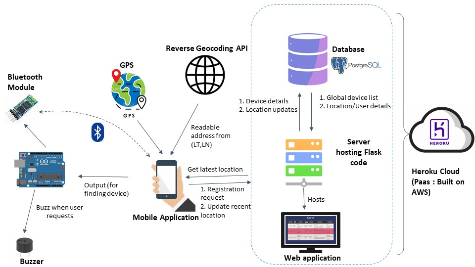

# BuzzTag - A Bluetooth enabled tagger to keep track of your things
## Introduction
Items like wallets, keys and backpacks often get lost with no easy way of finding them. This project aims to build a Bluetooth based tag to keep track of such items. The tag includes a buzzer to locate it, once it is in the range of the owner’s mobile device. The Android app on the user’s mobile helps in keeping track of the last recorded location of the tag. Location of a tag can get updated from any device that has the app when the tag is in range of the mobile device. It is not necessary for the tag to be registered for its location to update from the app. The contact details of the user who last updated the location of the tag can be viewed by the user who has registered the tag, thus enabling the user to find a lost item easily. A dynamic web page has also been provided for easier viewing the status of all registered devices.
## System Architecture

## Components
### The Tag
The tag consists of an Arduino UNO with a bluetooth module, connected to a buzzer through resistors. The tag is to be attached or kept in items likely to get lost. The Bluetooth makes the tag visible to the user’s mobile app identified by the Bluetooth module’s name and MAC address. If the tag receives a message of ‘1’ over Bluetooth, the microcontroller makes the buzzer sound a specific tune. This helps in locating the tag. 
### Android app
The Android app on the user side offers several functionalities. One can register a tag, buzz the tag, view its latest location and update the location of nearby tags within the mobile’s Bluetooth range. For updating or recording the location of a tag, the phone’s GPS is used. When the location of a tag is viewed by the user, a reverse geocoding API gets a human understandable location from the latitude and longitude. More on the functionalities offered by the app is described in a later section.  
More about the functionalities offered by the app -
* Register device - Scans and displays a list of nearby Bluetooth devices. On confirming to register, sends basic device and user information to the Flask backend hosted on Heroku, along with the GPS location of the phone. ([Code](https://github.com/samina-mulani/IoT-Project-Android-app/blob/master/app/src/main/java/com/example/iot_project/RegisterDevice.java#L163))
* Buzz device - Scans and displays a list of nearby registered Bluetooth devices. On confirming to buzz a selected device, connects to the device and sends a message via Bluetooth which causes the buzzer to ring. ([Code](https://github.com/samina-mulani/IoT-Project-Android-app/blob/master/app/src/main/java/com/example/iot_project/BuzzDevice.java#L77))
* Get recent location - On selecting a registered device from the displayed list, gets its most recent location from the PostgreSQL database hosted on the Heroku server. Also displays the contact details of the user who updated the latest location. ([Code](https://github.com/samina-mulani/IoT-Project-Android-app/blob/master/app/src/main/java/com/example/iot_project/GetLocation.java#L42)) 
* Scan and update - Gets the global list of all registered devices and if one of these is detected in a Bluetooth scan, sends the phone’s GPS location to the Flask backend, updating the location of the identified devices. ([Code](https://github.com/samina-mulani/IoT-Project-Android-app/blob/master/app/src/main/java/com/example/iot_project/MainActivity.java#L398))
### Flask Web Server and PostgreSQL database
* [Github Link](https://github.com/samina-mulani/IoT-Project-Backend)  
* Both these components are present in the cloud (Heroku PaaS used for hosting). The database holds information about the registered tags, their owners and the location updates for these tags. The Flask web server provides endpoints for communication between the Android app and relevant information from the database. The server also hosts a dynamic website for viewing information about the registered devices and their recent location. ([Website Link](https://iot-project-314.herokuapp.com/))
## Flow and Working from User side
* The app opens with a page to register the user details. It asks for bluetooth and location permissions. This app provides 4 major features:
  * Register New Device
  * Buzz your Device
  * Get Recent Location
  * Scan and Update
* First, the user has to register his device. For this, he uses the Register New Device   button.This button displays the list of all Bluetooth devices available in the user’s range. The device he picks up is stored in the database with him being designated as the owner.
* The User can then check the most recent location of any of his devices by using the Get Recent Location feature. Immediately after registration, it will show the location during the time of registration, as recorded by the phone’s GPS. This location can be updated by not only the owner but also by the other users of the app. This feature is useful in tracking down the lost devices of a user. Along with the location, the user will get the updater’s name and contact details. Hence, they can contact the updater in case they want them to pick their device.
* After reaching the latest location of his lost device, the user can use the feature Buzz your Device. The device will start buzzing when the user is in its bluetooth range. Hence, the user will be able to find it.
* There is another feature, Scan and Update. In case, the user's device is lost and he is out of its bluetooth range. Then, if any other registered user comes in the bluetooth range of his lost device, then his device’s location will be updated using GPS of that user’s mobile when he clicks on this scan and update button. So, if anyone sees any lost device, he can press this button and it will update the device’s location in the global list for its owner. When the owner presses the get recent location button, he will get this most updated location.  
## Future Scope
* Background bluetooth scanning and location updates at regular intervals.
* Using BLE (Bluetooth Low Energy) instead of bluetooth.
* Making the device more compact and rigid (by using Arduino Beetle, and so on).
* App optimization to make it less power consuming.

